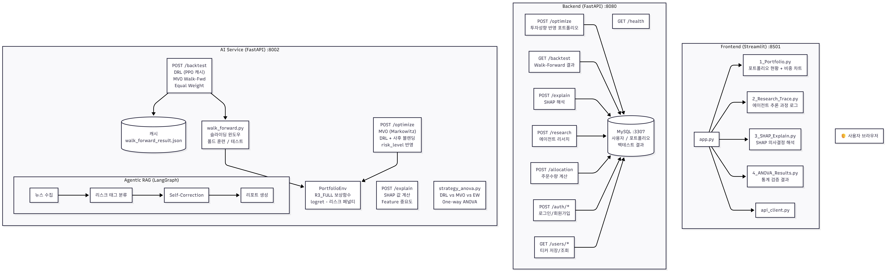
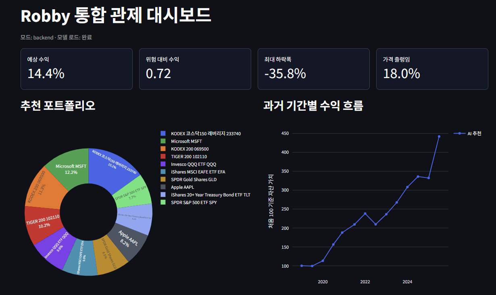
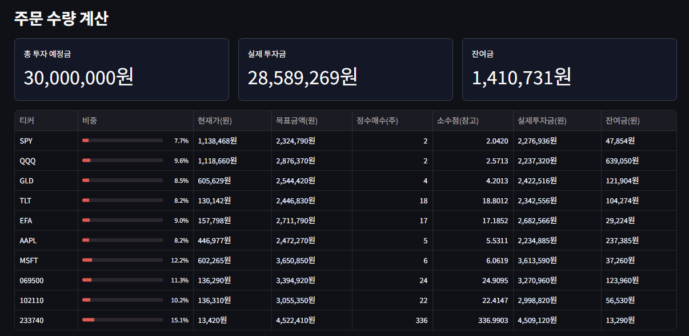
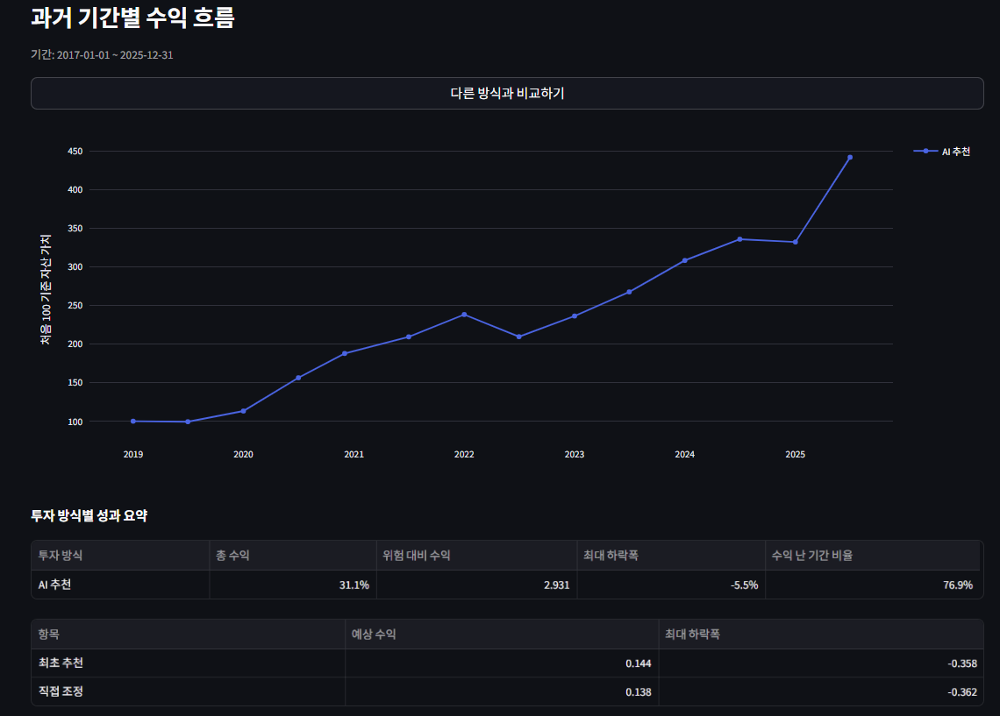
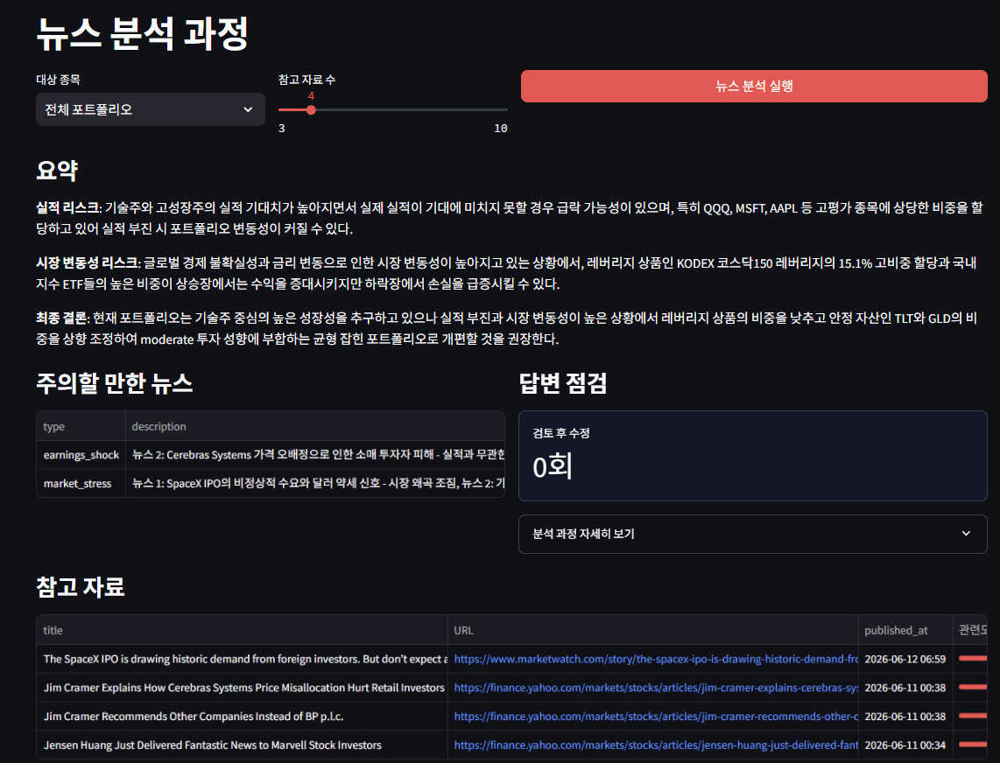
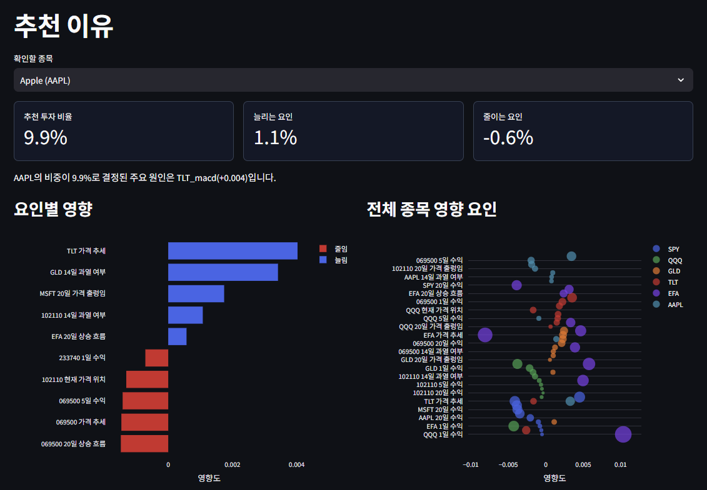
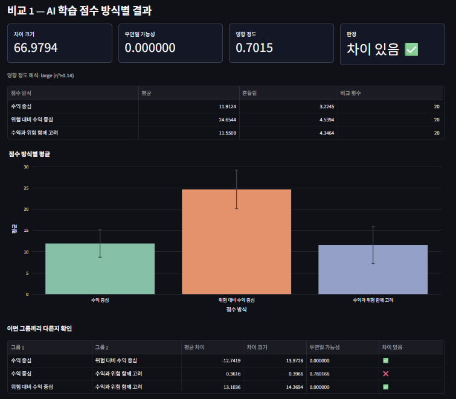
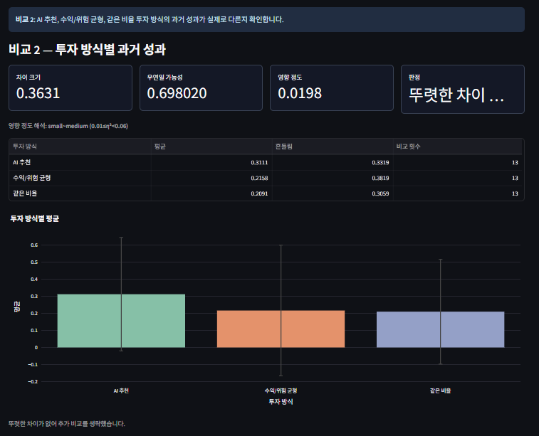
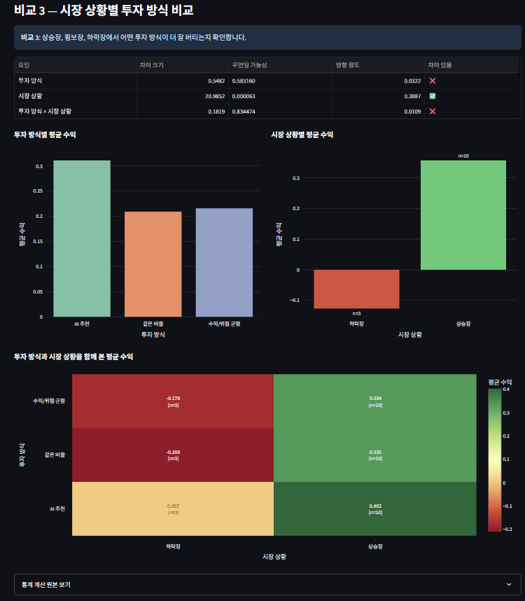

# README.md

## 1. 프로젝트 개요

본 프로젝트는 강화학습(PPO) 기반 동적 자산배분 엔진과 LLM 기반 에이전틱 투자 리서치 시스템을 결합한 **통합 자율 로보어드바이저**를 구현합니다. 단순 수익률 극대화가 아닌, "왜 이 자산을 매수했는가?"에 대한 논리적 근거(Reasoning Trace)를 제시하는 설명 가능한 AI 시스템을 목표로 합니다.

리서치 에이전트가 탐지한 위험 이벤트(규제 변경, 실적 쇼크, 지정학 리스크 등)를 **리스크 태그**로 변환하여 강화학습 환경의 관측 공간에 반영하고, Safe-Guard 모니터링과 연동하는 통합 파이프라인을 구성합니다. 이를 통해 "뉴스에서 발견된 리스크가 포트폴리오 비중 조정에 어떻게 반영되는가"를 end-to-end로 추적합니다.

성능의 절대적 우월성보다 **검증 가능한 과정**에 중점을 두며, Why(왜 이 보상 함수를 선택했는가), How(어떤 통계적 방법으로 검증했는가), When(어떤 시장 조건에서 전략이 유효한가)을 체계적으로 문서화합니다.

또한 사용자의 **투자 성향(안정형 / 보통형 / 적극형)** 에 따라 포트폴리오 비중을 차별화하여 추천하는 개인화 기능을 제공합니다. 동일한 자산 유니버스라도 성향별로 리스크 허용 범위와 자산 배분 비율이 다르게 산출되므로, 투자자 프로파일에 맞춘 실용적인 포트폴리오 제안이 가능합니다.

이에 더해, 추천된 포트폴리오 비중에 따라 실시간 주가를 반영하여 구매 가능 수량을 안내하고, 어려운 경제 용어들을 쉽게 풀어쓰며 서비스 사용의 장벽을 낮췄습니다.

## 2. 팀 소개

팀명: (팀명)

| **팀원** | **학번** | **이메일** |
| --- | --- | --- |
| **박주영** (팀장) | 20221557 | ceojooyoung@naver.com |
| **손기령** | 20201591 | jindoman0@naver.com |
| **홍지연** | 20211608 | chulsu0012@gmail.com |
| **심서연** | 20221571 | tlatjdus0531@naver.com |
| **심은** | 20221572 | tladms545@sogang.ac.kr |

## 3. 프로젝트 실행

```bash
# 환경 변수 설정
cp .env.example .env
# .env에서 ANTHROPIC_API_KEY, JWT_SECRET_KEY, MYSQL_ROOT_PASSWORD 등 설정

# 전체 서비스 실행 (AI + Backend + Frontend + MySQL + ChromaDB)
docker compose up --build

# 백그라운드 실행
docker compose up -d --build

# 전체 종료
docker compose down
```

배포 서비스: https://robby.elhye.com/


→ 자세한 절차는 [RUNBOOK.md](RUNBOOK.md) 참고

서비스 포트:

| 서비스 | URL | 설명 |
| --- | --- | --- |
| Frontend | http://localhost:8501 | Streamlit 대시보드 |
| Backend | http://localhost:8080 | FastAPI 게이트웨이 |
| Backend Swagger | http://localhost:8080/docs | API 문서 |
| AI Service | http://localhost:8002 | AI FastAPI (PPO/SHAP/RAG) |
| AI Health | http://localhost:8002/health | 모델·SHAP 로드 상태 |
| ChromaDB | http://localhost:8001 | 벡터 DB |
| MySQL | localhost:3307 | Backend DB |

### AI 모듈 단독 실행

```bash
cd ai

# 이미지 빌드
docker compose build ai

# 테스트 실행
docker compose run --rm ai

# AI API 서버 실행
docker compose --profile serve up serve

# PPO 학습 실행
docker compose --profile train run --rm train

# SHAP 실험 실행
docker compose --profile experiments run --rm shap

# 임의의 실험 스크립트 실행
docker compose run --rm ai python experiments/reward_experiment.py
docker compose run --rm ai python experiments/walk_forward_experiment.py
docker compose run --rm ai python experiments/mvo_experiment.py
docker compose run --rm ai python experiments/strategy_anova_experiment.py
docker compose run --rm ai python experiments/market_regime_anova_experiment.py
```

### 로컬 개발 환경 (venv)

```bash
cd ai
python -m venv .venv
source .venv/bin/activate  # Windows: .venv\Scripts\activate
pip install -r requirements.txt

# PPO 학습
python train.py

# 백테스트
python experiments/walk_forward_experiment.py

# 테스트
pytest tests/
```

## 4. 프로젝트 상세 내용



### 4-1. 기술 스택

#### **4-1-1. Backend / API**

- Python 3.10 이상
- FastAPI + Uvicorn — AI API 서버(포트 8001), Backend 게이트웨이(포트 8000)
- Pydantic — 요청/응답 Schema 자동 검증 및 Swagger UI 생성
- SQLAlchemy + Alembic — ORM 및 마이그레이션
- MySQL 8.0 — 사용자, 포트폴리오, 리서치 결과 영속화
- JWT — 인증/인가

#### **4-1-2. ML / AI**

- PyTorch — PPO 정책 신경망 기반
- Stable-Baselines3 (2.8.0) — PPO 학습 파이프라인 (MlpPolicy)
- Gymnasium (1.2.3) — RL 환경 인터페이스 (PortfolioEnv)
- SHAP (0.51.0) — KernelExplainer 기반 의사결정 해석 (Force/Summary/Waterfall Plot)
- SciPy — MVO(Mean-Variance Optimization) 최적화 (scipy.optimize.minimize)
- LangGraph (1.1.10) / LangChain — 에이전틱 RAG 다단계 워크플로우
- ChromaDB — 금융 뉴스 벡터스토어
- Anthropic API (Claude Haiku) — 리서치 리포트 생성 및 답변 품질 평가
- yfinance / pykrx — 해외·국내 주가 데이터 자동 수집
- scikit-learn — 피처 전처리, 스케일러

#### **4-1-3. Frontend / 시각화**

- Streamlit — 통합 관제 대시보드 (4개 페이지)
- Plotly — 포트폴리오 비중 파이차트, 누적 수익률 라인차트
- matplotlib — SHAP 플롯 (Force Plot, Summary Plot, Waterfall Plot)

#### **4-1-4. 인프라**

- Docker + Docker Compose — 5개 서비스(mysql, chromadb, ai, backend, frontend) 컨테이너화
- Pandas, NumPy — 시계열 데이터 전처리

### 4-2. 프로젝트 상세

#### 4-2-1. 데이터 수집 및 전처리

**`ai/src/data/`**

- **자산 유니버스** (10개): SPY, QQQ, GLD, TLT, EFA, AAPL, MSFT, 069500(KODEX 200), 102110(TIGER 미국 S&P500), 233740
- **수집 방법**: `yfinance.download()` (해외 ETF/주식) + `pykrx` (국내 ETF 6자리 종목코드 자동 판별)
- **수익률 변환**: 로그 수익률 `log(P_t / P_{t-1})` — 금융 시계열의 비정상성(Non-stationarity) 제거
- **결측치 처리**: Forward Fill 후 잔여 결측치 제거, yfinance 캐시(`ai/.cache/market/`) 활용
- **피처 정규화**: Rolling Z-score `(x - μ_N) / σ_N` 적용 (관측 윈도우 N, 기본 20일)
- **기술적 지표**: RSI(14), MACD(12-26-9), Bollinger Band Position (0~1 정규화)
- **자산별 피처 8개**: `ret1d, ret5d, ret20d, vol20d, mom20d, rsi14, macd, bb_position`

#### 4-2-2. 강화학습 환경 설계

**`ai/src/envs/portfolio_env.py`**

- **Gymnasium 호환 커스텀 환경** (`PortfolioEnv`): 금융 거래 시뮬레이터
- **관측 공간** (95차원 기본):

  | 구성 | 차원 | 설명 |
  | --- | ---: | --- |
  | 시장 피처 | 80 (= 10자산 × 8) | 수익률, 변동성, 모멘텀 + RSI, MACD, BB Position |
  | 리스크 태그 | 5 | regulatory, earnings_shock, geopolitical, market_stress, liquidity |
  | 현재 비중 | 10 | 직전 포트폴리오 비중 |

- **행동 공간**: 연속형 logit 벡터 → softmax 변환 → 비중 합 = 1 (공매도 없음)
- **거래 비용**: 수수료 0.015% + 슬리피지 0.05% (리밸런싱 turnover에 비례 차감)
- **MDD Safe-Guard**: 낙폭 25% 초과 시 에피소드 조기 종료 / 20% 초과 시 균등분산 강제 (규제 대응 XAI 로그 유지)

#### 4-2-3. 보상 함수 3종 설계

**`ai/src/envs/portfolio_env.py` — `RewardVariant`**

| 변형 | 수식 | 목적 |
| --- | --- | --- |
| `R1_LOGRET` | `log(1 + r_t) × 100` | 단순 수익률 기반 baseline |
| `R2_SHARPE` | `μ_N / σ_N` (롤링 Sharpe) | 위험 조정 수익률 반영 |
| `R3_FULL` | `log return − λ × risk_agg × concentration − μ × drawdown` | 수익률 + 리스크 태그 집중도 패널티 + MDD 패널티 통합 |

- **R3_FULL 설계 근거**: 리스크 태그가 주입될 때만 집중도 패널티 활성화 → 에이전트가 뉴스 리스크 신호에 반응하여 분산 투자 유도. Drawdown 패널티는 매 스텝이 아닌 MDD 임계값 근접 시에만 적용하여 신호 압도 방지.
- **lambda(MDD 패널티 강도)** 탐색 범위: 0.5 ~ 5.0 (기본값 1.0). 실험 결과 `lambda=1.0` ~ `lambda=2.0` 구간에서 MDD-수익률 트레이드오프 최적.

#### 4-2-4. PPO 강화학습 모델

**`ai/src/agents/ppo_agent.py`, `ai/train.py`**

- **알고리즘**: PPO (Proximal Policy Optimization) — Stable-Baselines3 `MlpPolicy`
- **최종 학습 하이퍼파라미터**: learning_rate=1e-4, batch_size=256, n_steps=2048, gamma=0.99, risk_penalty_lambda=0.5
- **학습 스텝**: 225,000 스텝 (실험 비교 범위: 30K ~ 500K; 225K에서 Sharpe 안정화 확인)
- **관측 윈도우**: window_size=30 (단기 모멘텀·노이즈 트레이드오프 고려)
- **체크포인트**: 50,000 스텝마다 저장 (`ai/checkpoints/portfolio_ppo_*.zip`)
- **학습 곡선**: `ai/checkpoints/learning_curve.png` 자동 생성 (수렴 여부 확인)
- **MVO 폴백**: 체크포인트 미존재 또는 관측 공간 불일치 시 자동으로 MVO 전략 적용

#### 4-2-5. MVO(정적 최적화) 기준선

**`ai/src/backtest/mvo.py`**

- **알고리즘**: Markowitz 평균-분산 최적화 (`scipy.optimize.minimize`)
- **목적함수**: 최대 Sharpe ratio 포트폴리오 (기본) / 최소 분산 포트폴리오 선택 가능
- **공분산 행렬**: 과거 252 거래일(약 1년) 롤링 윈도우 추정 + 정규화 (`1e-5`)
- **제약조건**: 비중 합 = 1, 공매도 금지(비중 ≥ 0), 개별 자산 최대 비중 ≤ 40%
- **리밸런싱 주기**: 월 1회 (매월 첫 거래일)
- **활용**: DRL과의 공정한 비교를 위한 정적 최적화 기준선

#### 4-2-6. Walk-Forward 백테스트

**`ai/src/backtest/walk_forward.py`**

- **방식**: Walk-Forward Validation — 학습 24개월 → 테스트 6개월 슬라이딩 윈도우
- **성과 지표 12개**: 누적 수익률(Total Return), CAGR, 연환산 변동성, MDD, VaR(95%), CVaR(95%), Sharpe, Sortino, Calmar, Alpha, Beta, Information Ratio
- **벤치마크 비교**: S&P500(SPY) 대비 Alpha, Beta, Information Ratio 산출
- **3가지 전략 비교**: DRL(PPO) vs MVO vs 동일가중(Equal-Weight)

현재 Walk-Forward 백테스트 결과 요약 (Fold 13개 기준, 2019-01 ~ 2025-07):

| 지표 | DRL(PPO) | MVO | Equal-Weight |
| --- | ---: | ---: | ---: |
| 평균 CAGR | **0.3111** | 0.2150 | 0.2108 |
| 표준편차 CAGR | 0.3319 | - | - |
| 평균 Sharpe | **2.9314** | 1.0357 | 1.2358 |
| 평균 Sortino | - | 1.6432 | **2.0556** |
| 평균 MDD | **0.0554** | 0.1068 | 0.1200 |
| 평균 변동성 | - | 0.1609 | 0.1545 |
| 평균 VaR 95% | - | 0.0151 | 0.0146 |
| 평균 CVaR 95% | - | 0.0219 | 0.0210 |
| 평균 Calmar | - | 4.4881 | 3.7358 |
| 평균 Alpha (vs SPY) | - | 0.0387 | - |
| 평균 Beta (vs SPY) | - | 0.7572 | - |
| 평균 IR (vs SPY) | - | -0.1097 | - |

#### 4-2-7. SHAP 의사결정 해석

**`ai/src/xai/shap_explainer.py`**

- **규제 요건(XAI 의무화) 대응**: 강화학습 모델의 포트폴리오 비중 결정 근거를 특성 중요도로 설명
- **방법**: SHAP `KernelExplainer` (모델 구조 무관, 임의의 블랙박스 적용 가능)
- **Plot 종류**:
  - **Summary Plot**: 여러 관측값에 걸친 피처별 중요도 분포
  - **Force Plot**: 단일 시점의 피처별 기여도 (Push/Pull 형태)
  - **Waterfall Plot**: 피처별 SHAP 기여도 누적 시각화
- **결과 예시 Top-5 피처**:

  | 피처 | 평균 절대 SHAP |
  | --- | ---: |
  | SPY_macd | 0.1081 |
  | GLD_bb_position | 0.0995 |
  | QQQ_bb_upper | 0.0743 |
  | GLD_ret5d | 0.0584 |
  | 069500_bb_lower | 0.0533 |

#### 4-2-8. 에이전틱 투자 리서치 (LangGraph + RAG)

**`ai/src/research/agentic_rag.py`**

- **LangGraph 기반 다단계 에이전트 워크플로우**: `plan → retrieve → grade → rewrite → analyze → verify → correct`
- **Self-Correction 루프**: 답변 품질이 낮으면(길이 부족, 리스크 미반영, Claude 품질 점수 < 0.5) 최대 2회 자동 재생성
- **벡터스토어**: ChromaDB — 금융 뉴스 임베딩 저장 및 유사도 검색
- **Source Citation 의무화**: 모든 리서치 결과에 원문 출처(URL, 제목, 발행일) 포함
- **리스크 태그 5종** 자동 탐지:

  | 리스크 태그 | 트리거 키워드 예시 |
  | --- | --- |
  | `regulatory_risk` | 규제, 제재, 소송, 금리, law, sec |
  | `earnings_shock` | 실적, 매출, 어닝, earnings, guidance |
  | `geopolitical_risk` | 관세, 무역, 전쟁, tariff, sanction |
  | `market_stress` | 급락, 변동성, 침체, crash, recession |
  | `liquidity_risk` | 유동성, 파산, 부채, liquidity, default |

- **RL 파이프라인 연동**: 탐지된 리스크 태그를 `PortfolioEnv.inject_risk_tags()`로 주입 → 관측 공간 자동 반영 → Safe-Guard 모니터링 트리거

#### 4-2-9. ANOVA 통계 검증

**`ai/experiments/`**

3가지 ANOVA 검증을 통해 전략 선택과 환경 설계의 통계적 근거를 확보합니다.

**검증 1 — 보상 함수 변형 비교 (One-way ANOVA)**

| 항목 | 값 |
| --- | ---: |
| F-statistic | 43.04 |
| p-value | < 0.0001 |
| 결론 | 유의함 (α=0.05) |

그룹별 평균 Episode Reward: R2_SHARPE(36.94) > R3_FULL(−5.37) > R1_LOGRET(−0.03). 보상 함수마다 스케일과 페널티 구조가 다르므로 백테스트 지표(MDD, Sharpe, CAGR)와 함께 종합 판단.

**검증 2 — 전략 비교 (One-way ANOVA)**

| 항목 | 값 |
| --- | ---: |
| F-statistic | 0.1702 |
| p-value | 0.8444 |
| eta squared | 0.0125 |
| 결론 | 유의하지 않음 |

DRL이 MVO, 동일가중보다 통계적으로 유의하게 우월하다고 주장할 수 없음. Fold당 단일 시드 학습과 높은 시장 국면 민감도가 원인.

**검증 3 — 전략 × 시장 국면 (Two-way ANOVA)**

| 요인 | F | p-value | partial η² | 결론 |
| --- | ---: | ---: | ---: | --- |
| Strategy | 0.254 | 0.778 | 0.024 | 유의하지 않음 |
| Regime | 11.41 | 0.0004 | 0.521 | **유의함** |
| Interaction | 0.235 | 0.915 | 0.043 | 유의하지 않음 |

시장 국면(Bull/Bear/Sideways)이 전략보다 수익률에 더 큰 영향을 미침. Bear 표본이 1개로 불균형하므로 해석에 주의 필요.

#### 4-2-10. 통합 관제 대시보드

**`frontend/streamlit_app/`**

- 대시보드는 모델을 직접 로드하지 않고 FastAPI 서버와 HTTP 통신
- **5개 페이지 구성** (app 포함):

  | 페이지 | 기능 |
  | --- | --- |
  | Portfolio (1_Portfolio.py) | 현재 자산 비중, 누적 수익률 차트, DRL/MVO/동일가중 전략 선택 및 최적화, 투자 성향(안정형/보통형/적극형)별 포트폴리오 비중 차별화 추천 |
  | Research Trace (2_Research_Trace.py) | 티커/질문 입력 → LangGraph 추론 과정 → 리서치 리포트 출력 |
  | SHAP Explain (3_SHAP_Explain.py) | 의사결정 설명 시각화 (Force Plot, Summary Plot, Waterfall Plot) |
  | ANOVA Results (4_ANOVA_Results.py) | 통계 검증 요약 테이블 및 분포 시각화 |

**추천 포트폴리오 비중 시각화**

투자 성향 및 전략에 따라 산출된 자산별 포트폴리오 비중을 파이차트로 시각화하고, 예상 수익·위험 대비 수익·최대 하락폭·가격 출렁임 등 핵심 지표를 한눈에 확인할 수 있습니다.



**실제 주가 반영 종목별 주문 수량 계산**

총 투자 예정금을 입력하면 추천 비중과 실시간 주가를 바탕으로 종목별 정수 매수 수량·목표 금액·실제 투자금·잔여금을 자동 산출합니다.



**전략에 따른 과거 기간별 수익 흐름**

AI 추천(DRL/PPO), 수익/위험 균형(MVO), 같은 비율(동일가중) 세 가지 전략의 누적 수익률을 기간별로 비교하고, 총 수익·위험 대비 수익·최대 하락폭·수익 난 기간 비율 등 성과 지표를 요약합니다.



**포트폴리오 추천의 주된 근거인 뉴스 분석 결과**

LangGraph 기반 에이전틱 RAG가 수집·분석한 뉴스 요약, 탐지된 리스크 태그, 참고 자료 출처를 제공합니다. Self-Correction 루프 검토 횟수와 분석 과정 세부 로그도 확인할 수 있습니다.



**PPO 모델의 종목별 추천 비중과 경제적 지표 영향**

SHAP KernelExplainer를 통해 각 종목의 추천 비중이 결정된 주된 요인(경제적 지표)과 그 영향 방향·크기를 요인별 영향 차트 및 전체 종목 영향 요인 산점도로 시각화합니다.



**3종 ANOVA 통계 검증 대시보드**

보상 함수 변형 비교(One-way ANOVA), 전략별 과거 성과 비교(One-way ANOVA), 시장 상황별 투자 방식 비교(Two-way ANOVA) 세 가지 통계 검증 결과를 시각화합니다.







#### 4-2-11. API 서버 엔드포인트

**`backend/app/routers/`, `ai/src/api/main.py`**

| Method | Path | 설명 |
| --- | --- | --- |
| GET | /health | 서버 상태 및 PPO 모델·SHAP 로드 여부 |
| POST | /optimize | DRL/MVO/동일가중 포트폴리오 비중 최적화 |
| POST | /explain | 특정 관측 시점의 SHAP 의사결정 해석 |
| POST | /research | 에이전틱 RAG 투자 리서치 리포트 생성 |
| GET | /backtest | Walk-Forward 백테스트 성과 지표 조회 |
| POST | /anova | ANOVA 검증 결과 조회 |

## 5. 면책 조항

본 프로젝트는 교육 및 연구 목적의 로보어드바이저 실험 시스템입니다. 산출된 포트폴리오 비중, 백테스트 결과, 리서치 리포트는 실제 투자 조언이 아니며 미래 수익을 보장하지 않습니다. 실제 투자 판단은 투자자 본인의 책임하에 이루어져야 합니다.
